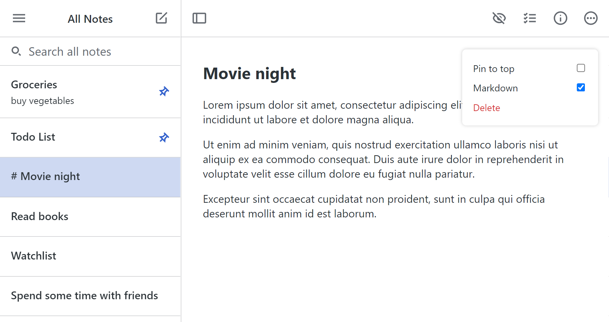
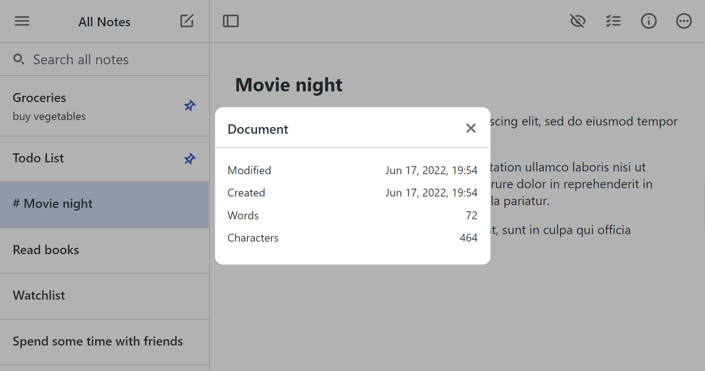

<div id="top"></div>

<!-- PROJECT LOGO -->
<br />
<div align="center">
  <h1 align="center">Simplenote Clone</h3>

  <p align="center">
    <a href="https://github.com/ianarseferov/simplenote-clone/README.md"><strong>Explore the docs »</strong></a>
    <br />
    <br />
    <a href="https://simplenote-clone-anarseferov.vercel.app/">View Demo</a>
    ·
    <a href="https://github.com/ianarseferov/simplenote-clone/issues">Report Bug</a>
    ·
    <a href="https://github.com/ianarseferov/simplenote-clone/issues">Request Feature</a>
  </p>
</div>

<!-- TABLE OF CONTENTS -->
<details>
  <summary>Table of Contents</summary>
  <ol>
    <li>
      <a href="#about-the-project">About The Project</a>
      <ul>
        <li><a href="#built-with">Built With</a></li>
      </ul>
    </li>
    <li>
      <a href="#getting-started">Getting Started</a>
      <ul>
        <li><a href="#prerequisites">Prerequisites</a></li>
        <li><a href="#installation">Installation</a></li>
      </ul>
    </li>
    <li><a href="#roadmap">Roadmap</a></li>
    <li><a href="#contributing">Contributing</a></li>
    <li><a href="#license">License</a></li>
    <li><a href="#contact">Contact</a></li>
  </ol>
</details>

<!-- ABOUT THE PROJECT -->

## About The Project

<div align="center">
</br>

</div>

The idea of this project is simple. Create a clone of [simple-note](https://simplenote.com/). Which it's one of the most popular note editors. Its has markdown support. Write, preview, and edit your notes in Markdown format. Right now add to do list and menu button doesn't work. Also it stores data to local storage. For future updates I will add firebase for auth and data persistence, setting menu for editing account, changing theme and so on. You can use both on desktop and mobile devices.   

### Built With

- [React.js](https://reactjs.org/)
- [React Markdown](https://www.npmjs.com/package/react-markdown)
- [react-router-dom](https://reactrouter.com/)
- [react-syntax-highlighter](https://www.npmjs.com/package/react-syntax-highlighter)
- [uuid](https://www.npmjs.com/package/uuid)
- [remark-gfm](https://www.npmjs.com/package/remark-gfm)
- Pure CSS
- Custom Hooks

<!-- GETTING STARTED -->

## Getting Started

### Prerequisites

Before you start install `node.js` on your machine. Download from [here](https://nodejs.org/en/)

### Installation

1. Clone the repo
   ```sh
   git clone https://github.com/ianarseferov/simplenote-clone.git
   ```
2. Install NPM packages
   ```sh
   npm install
   ```
3. Start local server
   ```
   npm start
   ```

<!-- ROADMAP -->

## Roadmap

- [x] Add Notes
- [x] Search Notes
- [x] Pin notes
- [x] Edit notes
- [x] Use as markdown
- [x] Delete note
- [x] Get info about note
- [ ] Add firebase authentication
- [ ] Add menu section
  - [ ] add settings component
  - [ ] add trash bin

See the [open issues](https://github.com/ianarseferov/simplenote-clone/issues) for a full list of proposed features (and known issues).

<!-- CONTRIBUTING -->

## Contributing

1. Fork the Project
2. Create your Feature Branch (`git checkout -b feature/AmazingFeature`)
3. Commit your Changes (`git commit -m 'Add some AmazingFeature'`)
4. Push to the Branch (`git push origin feature/AmazingFeature`)
5. Open a Pull Request

<!-- LICENSE -->

## License

Distributed under the MIT License. See `LICENSE.txt` for more information.

<!-- CONTACT -->

## Contact

[Github](https://github.com/ianarseferov)
